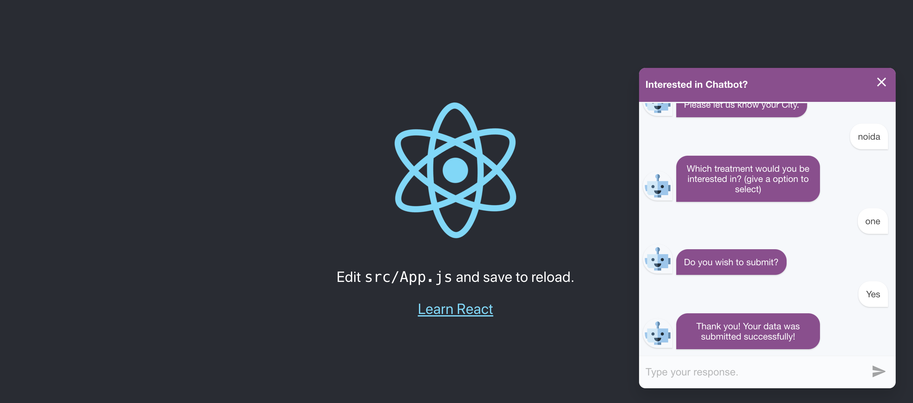

# react_chatbot_serverless

* update serverless.yaml

```
update bucketname , alliesName as per stage 


custom:
  stages:
    - dev
    - prod
  bucketName:
    dev: mybucketdev
    prod: mybucketprod
  alliesName:
    dev: "qa.domain.com,dev.domain.com"
    prod: "domain.com,www.domain.com"
 
update acm cert 

ViewerCertificate:
    AcmCertificateArn: arn:aws:acm:us-east-1:myawsid:certificate/65e701da----------
    SslSupportMethod: sni-only
    
```

* update handler_response.js

```
update fields as per business requirements 

const {
    fullName,
    phoneNumber,
    city,
    treatmentType
  } = requestBody;
  
```

* update business logic in frontend 

```
Update api gateway api endpoint in 
react_chatbot_serverless/react_chatbot/src/components/chatbot/Post.js

update chatbot steps , css in 
react_chatbot_serverless/react_chatbot/src/components/chatbot/SimpleForm.js


```



